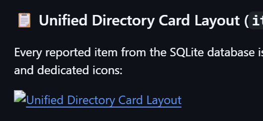

# Lost & Found Android Application

A modern, clean, and intuitive Android application designed to help users report and discover lost and found items. Built using **Kotlin**, **XML Layouts with ConstraintLayout**, **Material Components (Material3)**, and **SQLite** for robust local data persistence.

---

## 📱 Frontend Look & User Interface

Here is a visual overview of the modern Material design applied across the frontend screens:

### 🏠 Main Dashboard Launcher
The home screen features a clean dashboard grid with intuitive statistic indicators and brightly colored action buttons:
- 🔴 **REPORT LOST ITEM** – Styled with a red/danger theme for urgency.
- 🟢 **REPORT FOUND ITEM** – Styled with a green/success theme for discovery.
- 🔵 **VIEW ITEMS** – Styled with a blue/information theme to open the unified directory.


### 📋 Unified Directory Card Layout (`item_layout.xml`)
Every reported item from the SQLite database is automatically generated inside a structured `MaterialCardView` container with elevated borders and dedicated icons:




---

## 🚀 Features

- **Dashboard**: Simple and professional home screen with distinct color-coded actions.
- **Report Lost Items**: Seamless form to log lost articles with details like description, last known location, contact information, date, and a photo reference.
- **Report Found Items**: Easy reporting tool to document items discovered around the area.
- **Unified Items Directory**: View all reported items cleanly structured in vertical scroll lists.
- **Advanced Search & Filter**: Real-time interactive searching by item name or category, with filters for **ALL**, **LOST**, and **FOUND** items to narrow down listings instantly.
- **Card-Based UI**: Each record is beautifully contained within an elevated `MaterialCardView` using distinct color status badges (`LOST` in Red / `FOUND` in Green) for effortless scanning.
- **Item Removal**: Directly delete or resolve records via inline actions.

---

## 🛠️ Tech Stack & Concepts Covered

- **Language**: 100% Kotlin
- **Architecture**: Model-View-Controller (MVC) matching classic academic MAD specifications
- **UI Design**: Modern Android XML layouts utilizing **ConstraintLayout**, **Material3 UI**, and responsive styles
- **List Performance**: `RecyclerView` paired with a custom `ItemAdapter` featuring high-efficiency binding and state layout updates
- **Database**: Native `SQLiteOpenHelper` handling creation, reads, queries, and deletion workflows
- **Media Support**: Built-in support for processing on-device camera/gallery photo paths and displaying attachments in list cards

---

## 📐 Layout Architecture

This application strictly leverages `androidx.constraintlayout.widget.ConstraintLayout` inside all layouts to satisfy contemporary fluid layout principles and college course requirements.

### Component Layout Hierarchy:
- `activity_main.xml`: Main dashboard launcher area with stat summary blocks.
- `activity_view_items.xml`: Interactive search panel with directory list layout.
- `item_layout.xml`: Individual item blueprint styled using nested `MaterialCardView` containers.
- `activity_lost_item.xml` & `activity_found_item.xml`: Dynamic, user-friendly form input containers.

---

## 📥 Getting Started

### Prerequisites
- Android Studio Jellyfish (or later)
- Android SDK 34+
- Gradle 8.0+

### Installation & Run Steps
1. **Clone the repository**:
   ```bash
   git clone https://github.com/yourusername/LostFound.git
   ```
2. **Open in Android Studio**: Launch Android Studio and choose **Open an Existing Project**, then locate the root directory.
3. **Gradle Sync**: Let the IDE fetch dependencies and sync successfully.
4. **Deploy**: Click the green **Run** button to install the application onto an Android Virtual Device (AVD) emulator or a physical smartphone.

---

## 📂 Project Structure

```text
LostFound/
│
├── app/
│   ├── src/
│   │   └── main/
│   │       ├── java/com/example/lostfound/
│   │       │   ├── MainActivity.kt        # Home controller
│   │       │   ├── LostItemActivity.kt    # Report Lost controller
│   │       │   ├── FoundItemActivity.kt   # Report Found controller
│   │       │   ├── ViewItemsActivity.kt    # Directory & filter engine
│   │       │   ├── DatabaseHelper.kt      # SQLite persistence interface
│   │       │   ├── Item.kt                # Data schema model
│   │       │   └── ItemAdapter.kt         # RecyclerView binding manager
│   │       │
│   │       └── res/
│   │           ├── layout/                # UI blueprints (ConstraintLayout)
│   │           ├── values/                # System palettes, strings, themes
│   │           └── anim/                  # Custom UI search transition anims
```

---

## 🎓 Academic Disclaimer
This project is designed as part of a college **Mobile Application Development (MAD)** curriculum to exhibit clean UI layout patterns, SQLite integrations, and robust material component adapters.
